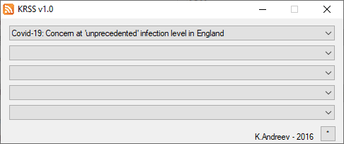
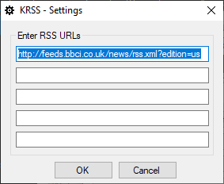
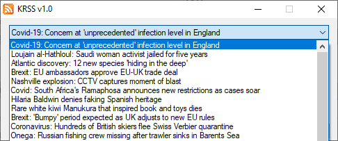
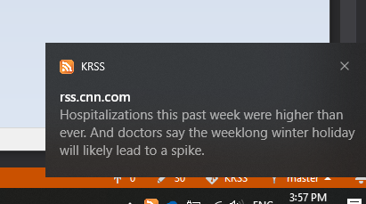

# KRSS

KRSS is a small .NET utility that acts as a RSS reader. Simply add up to 5 RSS URLs and you can see the latest feeds from those sites. 

# Usage

Click on the button in the lower right corner to open up the RSS editor.

Enter up to five RSS URLs and click OK. When you go back, wait for about 3-5 seconds for the feed to load. 
Then, you can click on each individual entry and your default browser will open up that page. 

When something news comes up, the feed will be refreshed and you'll get a notification in the tray as well.

If you don't like some RSS channels, simply edit and remove the URL.

**NOTE:** If there are any issues with the RSS channels and the program crashes, remove the whole **KRSS** folder under **%LOCALAPPDATA%**.

# Feeds

Here are some news feeds.

# CNN - http://rss.cnn.com/rss/cnn_topstories.rss
# Fox News - https://feeds.foxnews.com/foxnews/latest
# BBC - http://feeds.bbci.co.uk/news/rss.xml?edition=us